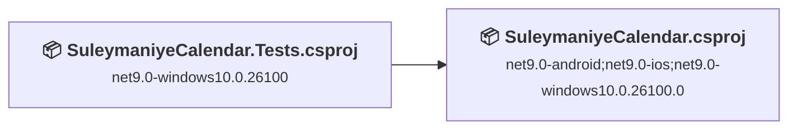
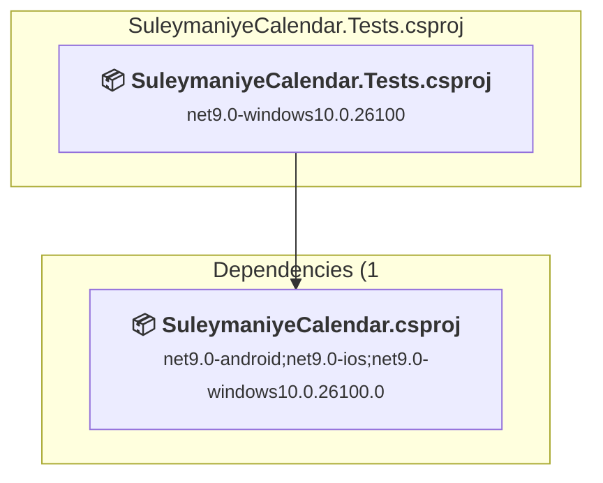
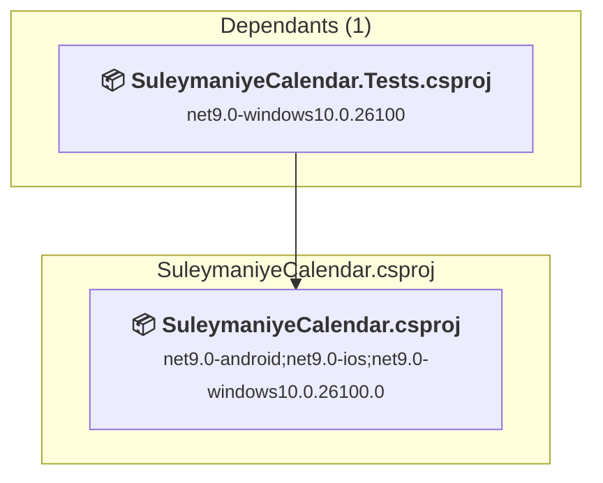

# Projects and dependencies analysis

This document provides a comprehensive overview of the projects and their dependencies in the context of upgrading to .NETCoreApp,Version=v10.0.

## Table of Contents

- [Executive Summary](#executive-Summary)
  - [Highlevel Metrics](#highlevel-metrics)
  - [Projects Compatibility](#projects-compatibility)
  - [Package Compatibility](#package-compatibility)
  - [API Compatibility](#api-compatibility)
- [Aggregate NuGet packages details](#aggregate-nuget-packages-details)
- [Top API Migration Challenges](#top-api-migration-challenges)
  - [Technologies and Features](#technologies-and-features)
  - [Most Frequent API Issues](#most-frequent-api-issues)
- [Projects Relationship Graph](#projects-relationship-graph)
- [Project Details](#project-details)

  - [SuleymaniyeCalendar.Tests\SuleymaniyeCalendar.Tests.csproj](#suleymaniyecalendartestssuleymaniyecalendartestscsproj)
  - [SuleymaniyeCalendar\SuleymaniyeCalendar.csproj](#suleymaniyecalendarsuleymaniyecalendarcsproj)

## Executive Summary

### Highlevel Metrics

| Metric | Count | Status |
| :--- | :---: | :--- |
| Total Projects | 2 | All require upgrade |
| Total NuGet Packages | 13 | 1 need upgrade |
| Total Code Files | 89 |  |
| Total Code Files with Incidents | 80 |  |
| Total Lines of Code | 18601 |  |
| Total Number of Issues | 2881 |  |
| Estimated LOC to modify | 2878+ | at least 15.5% of codebase |

### Projects Compatibility

| Project | Target Framework | Difficulty | Package Issues | API Issues | Est. LOC Impact | Description |
| :--- | :---: | :---: | :---: | :---: | :---: | :--- |
| [SuleymaniyeCalendar.Tests\SuleymaniyeCalendar.Tests.csproj](#suleymaniyecalendartestssuleymaniyecalendartestscsproj) | net9.0-windows10.0.26100 | 🟢 Low | 0 | 594 | 594+ | DotNetCoreApp, Sdk Style = True |
| [SuleymaniyeCalendar\SuleymaniyeCalendar.csproj](#suleymaniyecalendarsuleymaniyecalendarcsproj) | net9.0-android;net9.0-ios;net9.0-windows10.0.26100.0 | 🟢 Low | 1 | 2284 | 2284+ | ClassLibrary, Sdk Style = True |

### Package Compatibility

| Status | Count | Percentage |
| :--- | :---: | :---: |
| ✅ Compatible | 12 | 92.3% |
| ⚠️ Incompatible | 0 | 0.0% |
| 🔄 Upgrade Recommended | 1 | 7.7% |
| ***Total NuGet Packages*** | ***13*** | ***100%*** |

### API Compatibility

| Category | Count | Impact |
| :--- | :---: | :--- |
| 🔴 Binary Incompatible | 18 | High - Require code changes |
| 🟡 Source Incompatible | 2846 | Medium - Needs re-compilation and potential conflicting API error fixing |
| 🔵 Behavioral change | 14 | Low - Behavioral changes that may require testing at runtime |
| ✅ Compatible | 18735 |  |
| ***Total APIs Analyzed*** | ***21613*** |  |

## Aggregate NuGet packages details

| Package | Current Version | Suggested Version | Projects | Description |
| :--- | :---: | :---: | :--- | :--- |
| CommunityToolkit.Maui | 12.3.0 |  | [SuleymaniyeCalendar.csproj](#suleymaniyecalendarsuleymaniyecalendarcsproj) | ✅Compatible |
| CommunityToolkit.Maui.MediaElement | 6.1.2 |  | [SuleymaniyeCalendar.csproj](#suleymaniyecalendarsuleymaniyecalendarcsproj) | ✅Compatible |
| CommunityToolkit.Mvvm | 8.4.0 |  | [SuleymaniyeCalendar.csproj](#suleymaniyecalendarsuleymaniyecalendarcsproj) [SuleymaniyeCalendar.Tests.csproj](#suleymaniyecalendartestssuleymaniyecalendartestscsproj) | ✅Compatible |
| coverlet.collector | 6.0.4 |  | [SuleymaniyeCalendar.Tests.csproj](#suleymaniyecalendartestssuleymaniyecalendartestscsproj) | ✅Compatible |
| FluentAssertions | 8.7.1 |  | [SuleymaniyeCalendar.Tests.csproj](#suleymaniyecalendartestssuleymaniyecalendartestscsproj) | ✅Compatible |
| LocalizationResourceManager.Maui | 1.2.2 |  | [SuleymaniyeCalendar.csproj](#suleymaniyecalendarsuleymaniyecalendarcsproj) | ✅Compatible |
| Microsoft.Extensions.Logging.Debug | 9.0.10 | 10.0.5 | [SuleymaniyeCalendar.csproj](#suleymaniyecalendarsuleymaniyecalendarcsproj) | NuGet package upgrade is recommended |
| Microsoft.Maui.Controls | 9.0.120 |  | [SuleymaniyeCalendar.csproj](#suleymaniyecalendarsuleymaniyecalendarcsproj) [SuleymaniyeCalendar.Tests.csproj](#suleymaniyecalendartestssuleymaniyecalendartestscsproj) | ✅Compatible |
| Microsoft.Maui.Controls.Compatibility | 9.0.120 |  | [SuleymaniyeCalendar.Tests.csproj](#suleymaniyecalendartestssuleymaniyecalendartestscsproj) | ✅Compatible |
| Microsoft.NET.Test.Sdk | 17.12.0 |  | [SuleymaniyeCalendar.Tests.csproj](#suleymaniyecalendartestssuleymaniyecalendartestscsproj) | ✅Compatible |
| Moq | 4.20.72 |  | [SuleymaniyeCalendar.Tests.csproj](#suleymaniyecalendartestssuleymaniyecalendartestscsproj) | ✅Compatible |
| MSTest.TestAdapter | 4.0.1 |  | [SuleymaniyeCalendar.Tests.csproj](#suleymaniyecalendartestssuleymaniyecalendartestscsproj) | ✅Compatible |
| MSTest.TestFramework | 4.0.1 |  | [SuleymaniyeCalendar.Tests.csproj](#suleymaniyecalendartestssuleymaniyecalendartestscsproj) | ✅Compatible |

## Top API Migration Challenges

### Technologies and Features

| Technology | Issues | Percentage | Migration Path |
| :--- | :---: | :---: | :--- |

### Most Frequent API Issues

| API | Count | Percentage | Category |
| :--- | :---: | :---: | :--- |
| T:Microsoft.Maui.Controls.Animation | 180 | 6.3% | Source Incompatible |
| T:Microsoft.Maui.Storage.Preferences | 178 | 6.2% | Source Incompatible |
| T:Microsoft.Maui.Controls.Application | 125 | 4.3% | Source Incompatible |
| T:Microsoft.Maui.FlowDirection | 107 | 3.7% | Source Incompatible |
| P:Microsoft.Maui.Controls.InputView.TextColor | 104 | 3.6% | Source Incompatible |
| T:Microsoft.Maui.Devices.Sensors.Location | 83 | 2.9% | Source Incompatible |
| M:Microsoft.Maui.Controls.Animation.#ctor(System.Action{System.Double},System.Double,System.Double,Microsoft.Maui.Easing,System.Action) | 80 | 2.8% | Source Incompatible |
| M:Microsoft.Maui.Controls.Animation.Add(System.Double,System.Double,Microsoft.Maui.Controls.Animation) | 80 | 2.8% | Source Incompatible |
| T:Microsoft.Maui.ApplicationModel.MainThread | 67 | 2.3% | Source Incompatible |
| P:Microsoft.Maui.Controls.Application.Current | 62 | 2.2% | Source Incompatible |
| P:Microsoft.Maui.Devices.Sensors.Location.Latitude | 55 | 1.9% | Source Incompatible |
| P:Microsoft.Maui.Devices.Sensors.Location.Longitude | 55 | 1.9% | Source Incompatible |
| T:Microsoft.Maui.Devices.DevicePlatform | 51 | 1.8% | Source Incompatible |
| T:Microsoft.Maui.Controls.ResourceDictionary | 42 | 1.5% | Source Incompatible |
| P:Microsoft.Maui.Controls.VisualElement.FlowDirection | 40 | 1.4% | Source Incompatible |
| M:Microsoft.Maui.Storage.Preferences.Get(System.String,System.String) | 39 | 1.4% | Source Incompatible |
| P:Microsoft.Maui.Controls.Application.Resources | 38 | 1.3% | Source Incompatible |
| M:Microsoft.Maui.ApplicationModel.MainThread.InvokeOnMainThreadAsync(System.Action) | 36 | 1.3% | Source Incompatible |
| M:Microsoft.Maui.Storage.Preferences.Get(System.String,System.Boolean) | 36 | 1.3% | Source Incompatible |
| M:Microsoft.Maui.Storage.Preferences.Set(System.String,System.String) | 32 | 1.1% | Source Incompatible |
| T:Microsoft.Maui.Easing | 28 | 1.0% | Source Incompatible |
| P:Microsoft.Maui.Controls.Label.TextColor | 27 | 0.9% | Source Incompatible |
| P:Microsoft.Maui.Controls.TimePicker.TextColor | 26 | 0.9% | Source Incompatible |
| P:Microsoft.Maui.Controls.Button.TextColor | 26 | 0.9% | Source Incompatible |
| P:Microsoft.Maui.Controls.Picker.TextColor | 26 | 0.9% | Source Incompatible |
| P:Microsoft.Maui.Controls.RadioButton.TextColor | 26 | 0.9% | Source Incompatible |
| P:Microsoft.Maui.Controls.DatePicker.TextColor | 26 | 0.9% | Source Incompatible |
| M:Microsoft.Maui.Storage.Preferences.Get(System.String,System.Double) | 25 | 0.9% | Source Incompatible |
| M:Microsoft.Maui.Storage.Preferences.Set(System.String,System.Boolean) | 24 | 0.8% | Source Incompatible |
| T:Microsoft.Maui.Controls.Shell | 23 | 0.8% | Source Incompatible |
| P:Microsoft.Maui.Controls.BindableObject.BindingContext | 23 | 0.8% | Source Incompatible |
| T:Microsoft.Maui.Controls.Border | 23 | 0.8% | Source Incompatible |
| T:Microsoft.Maui.Devices.DeviceInfo | 22 | 0.8% | Source Incompatible |
| T:Microsoft.Maui.ApplicationModel.AppTheme | 21 | 0.7% | Source Incompatible |
| T:Microsoft.Maui.Controls.BindingMode | 20 | 0.7% | Source Incompatible |
| M:Microsoft.Maui.Controls.Animation.#ctor | 20 | 0.7% | Source Incompatible |
| M:Microsoft.Maui.Controls.Animation.Commit(Microsoft.Maui.Controls.IAnimatable,System.String,System.UInt32,System.UInt32,Microsoft.Maui.Easing,System.Action{System.Double,System.Boolean},System.Func{System.Boolean}) | 20 | 0.7% | Source Incompatible |
| M:Microsoft.Maui.Devices.Sensors.Location.#ctor | 20 | 0.7% | Source Incompatible |
| M:System.TimeSpan.FromSeconds(System.Int64) | 19 | 0.7% | Source Incompatible |
| T:Microsoft.Maui.Dispatching.IDispatcher | 19 | 0.7% | Source Incompatible |
| P:Microsoft.Maui.Controls.BindableObject.Dispatcher | 19 | 0.7% | Source Incompatible |
| T:Microsoft.Maui.ApplicationModel.PermissionStatus | 18 | 0.6% | Source Incompatible |
| P:Microsoft.Maui.Devices.DeviceInfo.Platform | 17 | 0.6% | Source Incompatible |
| P:Microsoft.Maui.Devices.Sensors.Location.Altitude | 16 | 0.6% | Source Incompatible |
| P:Microsoft.Maui.Controls.ResourceDictionary.Item(System.String) | 16 | 0.6% | Source Incompatible |
| T:Microsoft.Maui.Controls.Grid | 16 | 0.6% | Source Incompatible |
| F:Microsoft.Maui.FlowDirection.LeftToRight | 14 | 0.5% | Source Incompatible |
| F:Microsoft.Maui.FlowDirection.RightToLeft | 14 | 0.5% | Source Incompatible |
| M:Microsoft.Maui.Controls.ContentPage.#ctor | 14 | 0.5% | Source Incompatible |
| T:Microsoft.Maui.Controls.Xaml.Extensions | 13 | 0.5% | Source Incompatible |

## Projects Relationship Graph

Legend:
📦 SDK-style project
⚙️ Classic project

## Project Details

### SuleymaniyeCalendar.Tests\SuleymaniyeCalendar.Tests.csproj

#### Project Info

- **Current Target Framework:** net9.0-windows10.0.26100
- **Proposed Target Framework:** net10.0--windows10.0.26100
- **SDK-style**: True
- **Project Kind:** DotNetCoreApp
- **Dependencies**: 1
- **Dependants**: 0
- **Number of Files**: 18
- **Number of Files with Incidents**: 18
- **Lines of Code**: 4592
- **Estimated LOC to modify**: 594+ (at least 12.9% of the project)

#### Dependency Graph

Legend:
📦 SDK-style project
⚙️ Classic project

### API Compatibility

| Category | Count | Impact |
| :--- | :---: | :--- |
| 🔴 Binary Incompatible | 0 | High - Require code changes |
| 🟡 Source Incompatible | 594 | Medium - Needs re-compilation and potential conflicting API error fixing |
| 🔵 Behavioral change | 0 | Low - Behavioral changes that may require testing at runtime |
| ✅ Compatible | 7635 |  |
| ***Total APIs Analyzed*** | ***8229*** |  |

### SuleymaniyeCalendar\SuleymaniyeCalendar.csproj

#### Project Info

- **Current Target Framework:** net9.0-android;net9.0-ios;net9.0-windows10.0.26100.0
- **Proposed Target Framework:** net9.0-android;net9.0-ios;net9.0-windows10.0.26100.0;net10.0-windows
- **SDK-style**: True
- **Project Kind:** ClassLibrary
- **Dependencies**: 0
- **Dependants**: 1
- **Number of Files**: 84
- **Number of Files with Incidents**: 62
- **Lines of Code**: 14009
- **Estimated LOC to modify**: 2284+ (at least 16.3% of the project)

#### Dependency Graph

Legend:
📦 SDK-style project
⚙️ Classic project

### API Compatibility

| Category | Count | Impact |
| :--- | :---: | :--- |
| 🔴 Binary Incompatible | 18 | High - Require code changes |
| 🟡 Source Incompatible | 2252 | Medium - Needs re-compilation and potential conflicting API error fixing |
| 🔵 Behavioral change | 14 | Low - Behavioral changes that may require testing at runtime |
| ✅ Compatible | 11100 |  |
| ***Total APIs Analyzed*** | ***13384*** |  |

